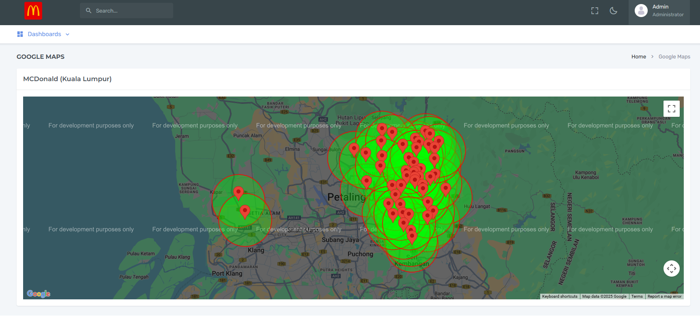
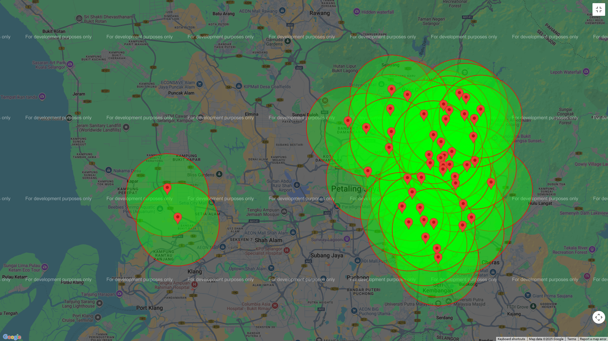
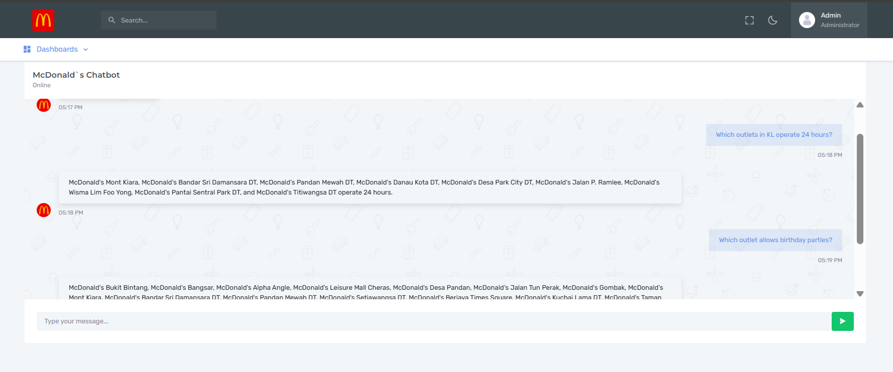

# McDonald’s Kuala Lumpur Discovery Project

## <ins>Introduction</ins>
This project is an extended version of the Subway Discovery Project, it aims to visualize McDonald’s outlets in Kuala Lumpur. Through web scraping, geocoding retrieval, API development, and front-end development, this project provides an interactive map interface for exploring McDonald’s locations across Kuala Lumpur. An LLM (Large Language Model) is implemented to assist users in answering specific questions, such as:
- Which outlets in KL operate 24 hours?
- Which outlet allows birthday parties?

## <ins>Implementation/ Technology</ins>
Technologies Used

- Database: PostgreSQL with PostGIS
- Web Scraping: Selenium, BeautifulSoup4
- Backend Development: Flask, FastAPI
- Frontend Development: React.js (Velzon template)
- LLM: OpenAI
- RAG Vector Database: Qdrant (running with Docker)

## <ins>Methodology/ Approach</ins>
In the past, the Subway Discovery project use `Haversine` formula to calculate the radius of locations in order to determine if they intersect. This project will use `Geodesic` method (via geopy) for more accurate distance calculation and `PostGIS` for native geospatial indexing and spatial queries.

| Method               | Description                                                                                                                                                                      |
|-----------------------|----------------------------------------------------------------------------------------------------------------------------------------------------------------------------------|
| **Haversine formula** | Calculates distance assuming Earth is a perfect sphere. Minor inaccuracies for large distances or high precision.                               |
| **Geodesic (geopy)**  | Uses Vincenty or WGS-84 ellipsoid models for geodesic distances on an ellipsoid. More accurate than Haversine.                 |
| **PostGIS**           | Extends PostgreSQL with native geospatial capabilities for spatial indexing, proximity searches, polygon operations, radius searches, and intersections.

### PostgreSQL (PostGIS)
Using `ST_SetSRID(ST_MakePoint(%s, %s), 4326)::GEOGRAPHY` stores location data in a way that PostGIS understands as real earth locations, enabling accurate geospatial queries. Without this, PostGIS treats the data as flat geometry, resulting in inaccurate calculations for latitude and longitude. For more information, see [https://postgis.net/docs/ST_MakePoint.html](https://postgis.net/docs/ST_MakePoint.html).

### Example: Insert Location with PostGIS
```
INSERT INTO mcdonald (
    name,
    address,
    telephone,
    latitude,
    longitude,
    categories,
    geom
)
VALUES (
    %s,  -- name
    %s,  -- address
    %s,  -- telephone
    %s,  -- latitude
    %s,  -- longitude
    %s,  -- categories
    ST_SetSRID(ST_MakePoint(%s, %s), 4326)::GEOGRAPHY  -- geom
```

### Example: Check 5 km Catchment Intersection
This query selects each McDonald's outlet and checks if there is any other outlet within 10 km (to determine if their 5 km catchments intersect). It adds a column `intersects_5km`:
- `1` → if at least one other outlet is within 10 km
- `0` → if none are within 10 km

```
    SELECT 
        a.id,
        a.name,
        a.address,
        a.latitude,
        a.longitude,
        CASE 
            WHEN EXISTS (
                SELECT 1 
                FROM mcdonald b
                WHERE a.id != b.id
                AND ST_DWithin(a.geom, b.geom, 10000)
            )
            THEN 1
            ELSE 0
        END AS intersects_5km
    FROM mcdonald a;
```
### Alternative: Geodesic Calculation via geopy
Using `geopy’s geodesic (Vincenty)`
Here is the code to check if two outlets' 5 km radius catchments intersect. It calculates the geodesic distance between two geographic coordinates using the WGS-84 ellipsoid model, which is more accurate than the Haversine formula (which assumes Earth is a perfect sphere).

```
from geopy.distance import geodesic

point1 = (lat1, lon1)
point2 = (lat2, lon2)

distance_km = geodesic(point1, point2).km

# check if their 5 km radius catchments intersect
if distance_km <= 10: # 5km + 5km
    print("The outlets' 5 km catchments intersect.")
else:
    print("The outlets' 5 km catchments do not intersect.")
```

### Chatbot Short-Term Memory Implementation
On the chatbot page, short-term memory is implemented so the bot remembers all previous messages within the current chat session. Here`s the key implementation. 
1. `React`: Maintain messages array in React state.
```
const [messages, setMessages] = useState([
  { role: "assistant", content: "Hello, how can I help you?" },
  { role: "user", content: "What time does McDonald's Bukit Bintang open?" },
  { role: "assistant", content: "McDonald's Bukit Bintang operates 24 hours daily." },
  { role: "user", content: "Which outlets have birthday party facilities?" },
  { role: "assistant", content: "Several outlets offer birthday party facilities, including McDonald's Bukit Bintang, Bangsar, and Alpha Angle." }
]);
```
2. Pass the full conversation history, including both user and assistant messages, to the API with each request.

### Alternative Chatbot Memory Implementation
Other methods might be 
- Backend session store (Redis)
- Database storage with user ID
- OpenAI function calling (Structured Memory)
- MCP (Model Context Protocol)
- Stateful frameworks
    - LangChain memory module (ConversationBufferMemory, etc..)
    - LLM orchestration tools (Built-in Session Memory, etc..)

## <ins>Instruction</ins>
### Prerequisite
KindlyeEnsure the following are installed before running the project.
- PostgreSQL with PostGIS extension enabled for geospatial capabilities
- Docker for running the Qdrant vector database
- Conda for environment management
- Create a `.env` file in the project root containing `OpenAI API key`
```
OPENAI_API_KEY=openai_api_key_here
```

### Setup Step
<ins>Step 1: Environment Setup</ins>
<br>
Create and activate Conda environment, then install required libraries.
```
conda create --name yourenv python=3.10
conda activate yourenv
pip install -r requirements.txt
```

<ins>Step 2: Database Creation</ins>
<br>
Run `creating_database.ipynb` to set up the database and tables. This script will remove any existing table and create new one.

<ins>Step 3: Web Scrapping & Data Population</ins>
<br>
Run `scraping.ipynb` to scrape McDonald's outlet data and populate the database.

<ins>Step 4: RAG (Qdrant) + LLM</ins>
<br>
Run `rag.ipynb` to set up the RAG with Qdrant and LLM embedding.

Start Qdrant using Docker:

```
docker pull qdrant/qdrant

docker run -p 6333:6333 -p 6334:6334 \
    -v "$(pwd)/qdrant_storage:/qdrant/storage:z" \
    qdrant/qdrant
```

<ins>Step 5: Backend Implementation</ins>
<br>
Run the backend API to serve outlet data and chatbot functionalities. This project uses the non-RAG endpoint for chatbot features because the dataset is small. If it becomes large in the future, RAG will be needed for efficiency.

RAG: Retrieves relevant outlet data first using a vector database (Qdrant), then asks the AI to answer based only on that. 

Non-RAG: Sends all outlet data directly to the AI and asks it to answer without any retrieval step.This project will be using the non_rag_query endpoint.

#### FastAPI (recommended)
```
uvicorn backend.api:app --reload --host 127.0.0.1 --port 8000
```
#### Available Endpoint
- http://localhost:8000/get_outlets for outlet data (PostGIS).
- http://localhost:8000/get_outlets_geodesic for outlet data (Geodesic).
- http://localhost:8000/non_rag_query for the non-RAG chat API.
- http://localhost:8000/rag_query for the RAG chat API.

If using Flask
```
conda activate yourenv
python backend/flask/api.py
```
- http://localhost:5000/get_outlets_geodesic for outlet data (Geodesic).
- http://localhost:5000/get_outlets for outlet data (PostGIS).
- http://localhost:5000/non_rag_query for the non-RAG chat API.
- http://localhost:5000/rag_query for the RAG chat API.

The code for the Flask implementation can be found in `backend/flask/api.py`, while the FastAPI implementation is located in `backend/api.py`.

<ins>Step 6: Frontend Implementation</ins>
<br>
To launch the user interface, navigate to the frontend React directory.
```
cd frontend/react
```
Install dependencies and start the development server.
```
yarn install
yarn start
```

Avoid using `npm install` as it may lead to significant errors with this project setup. Ensure using `Node v18.x.x` for successful package installation and build.

Key frontend source file
- src/pages/Home/index.js (Outlet visualization using PostGIS)
- src/pages/Home/index2.js (Outlet visualization using Geodesic calculation)
- src/pages/Chat/index.js (Chatbot interface)

## <ins>Result</ins>
Here is a look at the user interface for the map visualization of outlets.


Below is a complete visual representation of McDonald's outlets generated using PostGIS, showing their locations, 5 km radius coverage, and any intersections within that distance.


Other visualization based on Geodesic.


Here is the UI for interacting with the McDonald's chatbot, where can ask questions and receive answers.


### AWS EC2 Deployment
For deployment, will be using an AWS EC2 instance in the Singapore region, running Ubuntu 22.04. The instance is configured as a `t2.large` with 30 GiB of storage to provide sufficient space for Docker containers running FastAPI, Qdrant, and PostGIS services. The cloud resources will be connected by using Visual Studio Code via SSH, authenticated with a `.pem` key.

1. Download and install Miniconda
```
wget https://repo.anaconda.com/miniconda/Miniconda3-latest-Linux-x86_64.sh
bash Miniconda3-latest-Linux-x86_64.sh
```

2. Update existing package and install package
```
sudo apt update
sudo apt install -y unzip wget curl

# Might take amount of time to install
# sudo apt install -y chromium-driver chromium-browser

wget https://dl.google.com/linux/direct/google-chrome-stable_current_amd64.deb
sudo apt install -y ./google-chrome-stable_current_amd64.deb

google-chrome --version

wget https://storage.googleapis.com/chrome-for-testing-public/138.0.7204.157/linux64/chromedriver-linux64.zip

unzip chromedriver-linux64.zip
sudo mv chromedriver-linux64/chromedriver /usr/local/bin/
sudo chmod +x /usr/local/bin/chromedriver

chromedriver --version
```

3. Install Docker and Docker Compose

Follow the instructions here: [`install-using-the-repository`](https://docs.docker.com/engine/install/ubuntu/#install-using-the-repository)

Set up Docker's apt repository.
```
# Add Docker's official GPG key:
sudo apt-get update
sudo apt-get install ca-certificates curl
sudo install -m 0755 -d /etc/apt/keyrings
sudo curl -fsSL https://download.docker.com/linux/ubuntu/gpg -o /etc/apt/keyrings/docker.asc
sudo chmod a+r /etc/apt/keyrings/docker.asc

# Add the repository to Apt sources:
echo \
  "deb [arch=$(dpkg --print-architecture) signed-by=/etc/apt/keyrings/docker.asc] https://download.docker.com/linux/ubuntu \
  $(. /etc/os-release && echo "$VERSION_CODENAME") stable" | \
  sudo tee /etc/apt/sources.list.d/docker.list > /dev/null
sudo apt-get update
```
Install the Docker packages.
```
sudo apt-get install docker-ce docker-ce-cli containerd.io docker-buildx-plugin docker-compose-plugin
```
To run docker without `sudo`
```
sudo groupadd docker
sudo usermod -aG docker $USER
```
Reboot EC2 instance
```
sudo reboot
```
Test run Docker
```
docker run hello-world
```

4. Clone the repository
```
git clone https://github.com/christopher192/mcdonald-kl-discovery-project.git
```

5. Create `.env` file

Create `.env` file in the project `mcdonald-kl-discovery-project` root, make sure to fill in OpenAI API key.
```
OPENAI_API_KEY=open_api_key
POSTGRES_HOST=db
POSTGRES_PORT=5432
POSTGRES_DOCKER_HOST=localhost
POSTGRES_DOCKER_PORT=5555
POSTGRES_DB=postgis
POSTGRES_USER=postgres
POSTGRES_PASSWORD=admin
QDRANT_URL=http://qdrant:6333
QDRANT_DOCKER_URL=http://localhost:6333
```

6. Build and start all service
```
docker compose up --build
```
For detached (background) mode
```
docker compose up -d --build
```
Stop all running container
```
docker compose down
```
View real-time log
```
docker compose logs -f
```

7. Data Populating

Create Conda environment.
```
conda create -n mcdonald-discovery-env python=3.10 -y
conda activate mcdonald-discovery-env
```
Run the following scripts to populate data into `Qdrant` and `PostGIS` (running inside Docker).
```
pip install -r requirements.txt
python scrape_and_insert.py # Scrape outlet data and insert into PostGIS
python rag.py # Generate embeddings and insert into Qdrant
``` 

8. Allow inbound raffic in security group
    - Go to EC2 instance in the AWS Console.
    - Click on the Security Group attached to the instance.
    - Edit Inbound Rules and add.
        - Type: Custom TCP
        - Port Range: `3000`, `8000`
        - Source: `0.0.0.0/0` (to allow public access)

9. Access the App

Use EC2 Public IPv4 address in the browser.
```
http://<your-ec2-public-ip>:3000
```
